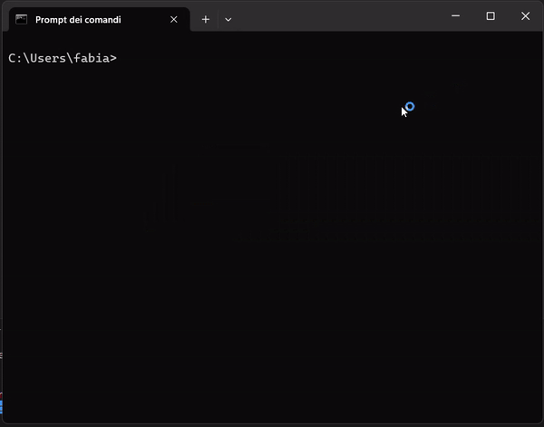

# SnakeCmdlet

Welcome to the SnakeCmdlet project! This project provides a custom cmdlet to play the classic Snake game directly from your Windows terminal.

## Installation

1. **Download the Code**:
   - Download the source code or clone the repository from GitHub to your local machine.

2. **Prerequisites**:
   - PowerShell is required to run the Snake cmdlet. PowerShell is preinstalled on Windows 7 and later versions. If you are using an older version of Windows, make sure to install PowerShell 5.1 or later.

3. **Add to System PATH**:
   - To use the Snake cmdlet from any location in the terminal, you need to add the project folder to the system PATH environment variable.
   - To add the folder permanently to the PATH, follow these steps:
     - Open the Start menu and search for "Environment Variables."
     - Click on "Edit the system environment variables."
     - Click on the "Environment Variables" button.
     - In the System variables section, find the "Path" variable and click "Edit."
     - Click "New" and add the path to the folder containing the Snake cmdlet.
     - Click "OK" to save the changes.
   - To add the project folder to the PATH temporarily
     - Open a PowerShell terminal and run the following command:
       ```powershell
       $env:PATH += ";C:\path\to\SnakeCmdlet"
       ```
     - Replace `C:\path\to\SnakeCmdlet` with the actual path to the folder containing the Snake cmdlet.

4. **Run the Cmdlet**:
   - Once the Snake cmdlet is in the system PATH, you can run it from any location in the terminal.
   - Open a PowerShell terminal and type either `sn` to start the Snake game.

   Note: You can customize the start command by renaming the file `sn` to your preferred name.

## Usage

Type `sn` on the Windows terminal to launch the game. Use the arrow keys to control the snake and collect food.

## Issue Reporting

If you encounter any bugs or have ideas to enhance the project, please open a new issue on GitHub. I will do my best to address the issues and make this cmdlet even better.

## License

This project is licensed under the [GNU General Public License v3.0 license](LICENSE).
